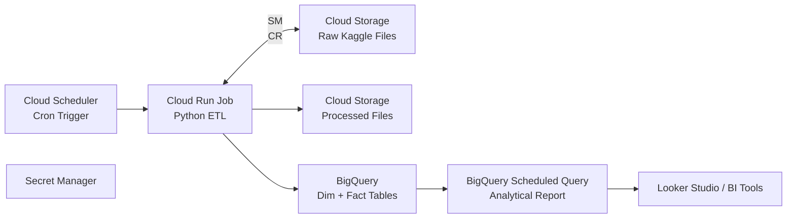

# Supermarket Sales ETL & Analytics Pipeline (Local + Cloud Design)

This project demonstrates an end-to-end data engineering workflow using a public Kaggle dataset.  
It includes:

- Automated **data extraction** using the Kaggle API  
- **Dimensional modeling** (three dimensions + one fact table)  
- **ETL pipeline** implemented in Python  
- **SQLite** analytical database (local environment)  
- **Analytical reporting SQL** with joins + window functions  
- A **cloud deployment design** (GCP) for production-grade automation  

This repository serves as both a **working local prototype** and a **blueprint for a scalable cloud ETL system**.

---

## 📦 Dataset

**Sales of a Supermarket**  
Kaggle link: https://www.kaggle.com/datasets/lovishbansal123/sales-of-a-supermarket

~1,000 invoice-level records including:

- store location (branch, city)  
- product line  
- customer type & gender  
- unit price, quantity, totals  
- gross income, margin  
- date, time, payment type  
- customer satisfaction rating  

---

## 🗂️ Project Structure

```
supermarket_etl_gcp/
│
├── src/
│   ├── extract_kaggle_data.py
│   └── transform_load_sqlite.py
│
├── sql/
│   ├── create_tables.sql
│   └── report_product_performance.sql
│
├── data_raw/
│   └── supermarket_sales.csv (downloaded automatically)
│
├── supermarket.db (generated)
│
└── README.md
```

---

## 🚀 Step 1: Data Extraction (Kaggle API)

Script: `src/extract_kaggle_data.py`

- Authenticates using the Kaggle API key  
- Downloads the dataset ZIP  
- Extracts `supermarket_sales.csv`  
- Stores it under `data_raw/`

Command:

```bash
python src/extract_kaggle_data.py
```


---

## 🧱 Step 2: Transform + Load (Dimensional Modeling)

Script: `src/transform_load_sqlite.py`  
Creates:

### **dim_location**
- location_id (PK)  
- branch  
- city  

### **dim_product**
- product_id (PK)  
- product_line  

### **dim_customer_segment**
- customer_segment_id (PK)  
- customer_type  
- gender  

### **fact_sales**
- invoice_id  
- location_id  
- product_id  
- customer_segment_id  
- date, time  
- price, quantity, totals  
- margins, income  
- rating  

Command:

```bash
python src/transform_load_sqlite.py
```

This generates **supermarket.db** with all four tables.

---

## 📊 Step 3: Analytical Reporting Query

File: `sql/report_product_performance.sql`

Produces aggregated product performance by location, including:

- transaction counts  
- total revenue  
- total units sold  
- gross income  
- average price  
- average rating  
- product ranking  
- revenue percent share  
- cumulative revenue % 
- window functions for location-level totals  

Run it in PyCharm’s **Database Console** or any SQLite client.

---

## ☁️ Step 4: Cloud Deployment Design (GCP)

Although local development uses SQLite, the cloud design replaces it with **BigQuery**, enabling scalable analytics.

### 🔧 Cloud Components

**Compute**
- Cloud Scheduler – triggers pipeline  
- Cloud Run – runs containerized Python ETL

**Storage**
- Cloud Storage (GCS) – raw + processed data

**Warehouse**
- BigQuery  
  - dim_location  
  - dim_product  
  - dim_customer_segment  
  - fact_sales  
  - report_product_performance (materialized table or view)

**Security**
- Secret Manager – API keys + secrets

**Reporting**
- Looker Studio or Looker for dashboards

**Monitoring**
- Cloud Logging & Cloud Monitoring

---

## 🏗️ GCP Architecture Diagram



---

## 🧠 Cloud Execution Flow

1. **Cloud Scheduler** fires daily.  
2. **Cloud Run** executes a containerized version of the ETL code.  
3. Raw data is saved to **GCS**.  
4. Transformed data is loaded into **BigQuery**.  
5. A **scheduled query** materializes analytical results.  
6. **Looker Studio** visualizes the reporting table.  
7. Logs and metrics flow into **Cloud Logging / Monitoring**.

---

## 🛠️ Technologies Used

- Python  
- Pandas  
- Kaggle API  
- SQLite (local)  
- BigQuery (cloud design)  
- Cloud Run, Cloud Scheduler, Secret Manager (cloud)  
- Looker Studio  

---

## ✔️ Summary

This project demonstrates:

- Local ETL and analytics  
- Dimensional modeling  
- Window-function-based SQL reporting  
- A scalable GCP architecture  
- Clean, production-style project structure  

It serves as both a **practical prototype** and a **cloud-ready design**.
