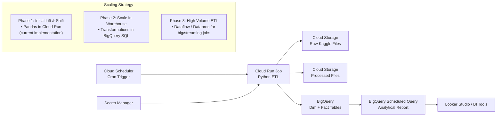

## 🏗️ GCP Architecture Diagram

```mermaid
flowchart LR
    CS[Cloud Scheduler<br/>Cron Trigger]
    CR[Cloud Run Job<br/>Python ETL]
    SM[Secret Manager]
    RAW[Cloud Storage<br/>Raw Kaggle Files]
    PROC[Cloud Storage<br/>Processed Files]
    BQ[BigQuery<br/>Dim + Fact Tables]
    BQREP[BigQuery Scheduled Query<br/>Analytical Report]
    BI[Looker Studio / BI Tools]

    CS --> CR
    SM --> CR
    CR --> RAW
    CR --> PROC
    CR --> BQ
    BQ --> BQREP
    BQREP --> BI

    %% Strategy Notes (Not connected to graph)
    subgraph Scale [Scaling Strategy]
        A["Phase 1: Initial Lift & Shift\n• Pandas in Cloud Run\n(current implementation)"]
        B["Phase 2: Scale in Warehouse\n• Transformations in BigQuery SQL"]
        C["Phase 3: High Volume ETL\n• Dataflow / Dataproc for big/streaming jobs"]
    end
```
