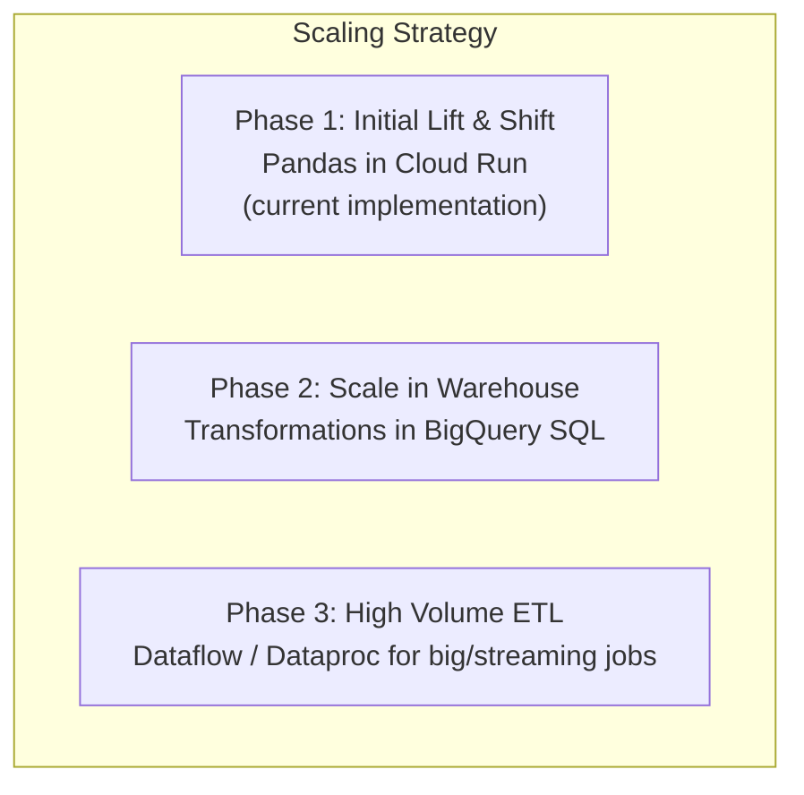

```mermaid
flowchart TB
    subgraph Scale [Scaling Strategy]
        A["<span style='white-space:nowrap'>Phase 1: Initial Lift & Shift<br/> Pandas in Cloud Run<br/>(current implementation)"]
        B["<span style='white-space:nowrap'>Phase 2: Scale in Warehouse<br/> Transformations in BigQuery SQL"]
        C["<span style='white-space:nowrap'>Phase 3: High Volume ETL<br/> Dataflow / Dataproc for big/streaming jobs"]
    end
```
