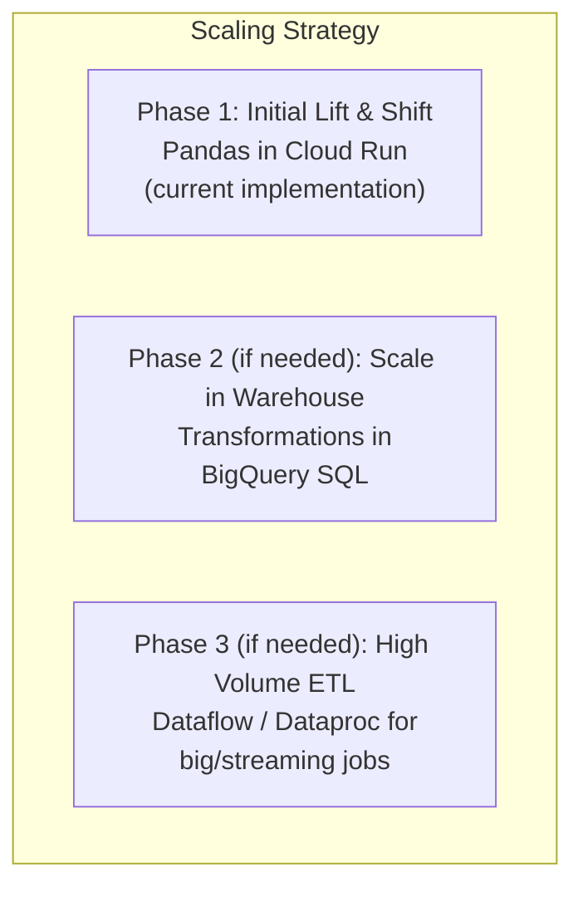

```mermaid
flowchart TB
    subgraph Scale [Scaling Strategy]
        A["Phase 1: Initial Lift & Shift<br/> Pandas in Cloud Run<br/>(current implementation)"]
        B["Phase 2 (if needed): Scale in Warehouse<br/> Transformations in BigQuery SQL"]
        C["Phase 3 (if needed): High Volume ETL<br/> Dataflow / Dataproc for big/streaming jobs"]
    end
```
